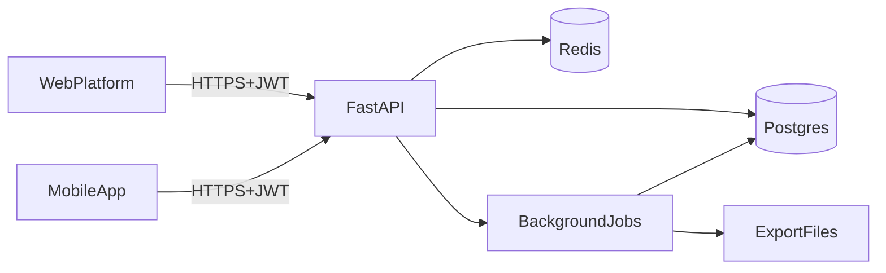

# TrackForge partner web platform + unified backend integration

## Product intent (what we’re building)

- **Web platform (for professionals)**: the operating system for dietitians/nutritionists to manage **clients**, build **meal plans** and **workout programs**, capture **medical context**, and run **analytics/research**.
- **Mobile app (for clients)**: the execution layer to follow assigned plans, log intake/training/metrics, and generate continuous signal between meetings.
- **Single backend (system-of-record)**: one API and one Postgres database powering both web + mobile, with shared rules, shared data model, and shared auditability.

## Constraints & design principles

- **Tenant model**: single-tenant now, but **multi-tenant-ready** (organization boundaries designed from day 1).
- **Target DB**: **PostgreSQL**.
- **Compliance assumption**: **baseline health-data security** (strong auth, encryption, audit) without committing to HIPAA/GDPR yet.
- **V1 web modules** (selected): **Client CRM**, **Meal plan builder**, **Workout plan builder**, **Medical data**, **Analytics**.

## Users, roles, and permissions (multi-tenant-ready)

### Core actor types

- **Staff users (web)**: dietitian, nutritionist, assistants, clinic admin.
- **Client users (mobile)**: end users following plans and logging data.

### Roles (V1)

- **org_admin**: manages staff, permissions, master data scope, imports.
- **dietitian**: full access to assigned clients, plans, analytics for those clients.
- **assistant**: limited write access (e.g., data entry), no exports.
- **researcher** (optional V1; can be admin-only initially): cohort queries + exports (with approval).

### Authorization model

- **Org boundary**: every record is scoped by `org_id` (or is explicitly “global knowledge base”).
- **Client boundary**: a client’s sensitive records are readable only by:
- that client
- staff in the same `org_id` with a valid relationship (assignment / team).
- **Policy enforcement**: start with application-level scoping + DB constraints; keep a clear path to Postgres RLS later.

## Web platform design (information architecture + UX)

### Global UX

- **App shell**: left sidebar navigation + top bar (global search, create button, notifications, user menu).
- **Global search**: search clients, foods, recipes, programs, conditions/meds.
- **Draft safety**: autosave drafts for plan builders; explicit “Publish” with versioning.
- **Auditability**: show “last edited by/when” on sensitive records.

### Navigation (V1)

- **Clients**
- **Meal plans**
- **Workout programs**
- **Medical**
- **Analytics**
- **Settings** (org settings, users/roles, import status)

### Module 1 — Client CRM

#### Key screens

- **Client list**: advanced filters (status, tags, assigned dietitian, goal, risk flags), saved views.
- **Client create/intake**: minimal required fields first; optional structured intake (goals, preferences, allergies, medical).
- **Client detail** (tabbed):
- **Overview**: goals, current plan summary, alerts, latest metrics.
- **Plans**: meal plan assignments, adherence, upcoming changes.
- **Workouts**: program assignments, completion, volume trends.
- **Medical**: conditions, meds, contraindication flags.
- **Progress**: weight/metrics timeline.
- **Notes & files**: structured notes + attachments (with permissions).

#### CRM features (V1)

- Assignment of clients to dietitian/team.
- Tags, statuses, and timelines.
- Attachments (PDF/images) with retention policy.
- “Next review” reminder metadata (no full scheduling module yet).

### Module 2 — Meal plan builder

#### Builder UX

- **Food library search**: by name, brand, barcode (future), dietary tags, allergens.
- **Recipe builder**: compose foods into recipes; portion scaling.
- **Calendar-based plan**: week view (days + meals) with drag/drop.
- **Nutrition panel**: calories + macros + key micros (configurable).
- **Constraints & warnings** (driven by medical profile): allergy conflicts, contraindicated nutrients, sodium limits, etc.
- **Versioning**:
- Draft → Publish (immutable version)
- Clone as new draft
- Compare versions

#### Assignment flow

- Assign plan version to client with start date + notes.
- Optional “client feedback loop” later (not required V1).

### Module 3 — Workout plan/program builder

#### Builder UX

- **Exercise library**: searchable, muscle groups, equipment, difficulty.
- **Program structure**: weeks → sessions → exercises.
- **Prescription fields**: sets/reps/weight/RPE/tempo/rest, plus progression rules.
- **Versioning + assignment**: same pattern as meal plans.

### Module 4 — Medical data

#### Knowledge base vs client-specific

- **Global dictionaries**: conditions, medications, allergens, contraindication rules (curated).
- **Client medical profile**: conditions, meds, allergies, labs (V1: store + display; advanced lab logic later).

#### Clinical safety features (baseline)

- Rule-driven warnings in meal/workout builders.
- Audit history on medical profile edits.

### Module 5 — Analytics & research

#### V1 dashboards

- **Per-client**: adherence, weight trend, training volume, consistency, plan compliance.
- **Clinic/team**: active clients, adherence distribution, outcomes snapshots.

#### Research workflows (V1 “safe MVP”)

- **Cohort builder** (admin/researcher only): filters by demographics, goals, conditions, time windows.
- **Exports**: asynchronous export jobs + approval gate; default to pseudonymized IDs.

## Unified backend architecture (FastAPI + Postgres)

### Architectural style

- **Modular monolith** (current structure) with clear domain boundaries and a stable API contract for both clients.

### Domain map (aligning with current repo)

- Existing:
- `auth`, `users`, `nutrition`, `workouts`, `progress`, `ocr`
- Add/extend for partner:
- **tenancy/orgs**: organizations, memberships, roles
- **clients** (could extend `users`): assignments, CRM notes/files
- **plans**: meal plan templates/versions/assignments
- **medical**: dictionaries + client medical profile
- **analytics**: materialized summaries + export jobs

### Key data model decisions (multi-tenant-ready)

- Add `org_id` to all org-scoped tables (clients, plans, logs, notes).
- Distinguish:
- **Global knowledge base** (shared: diseases, medications, core foods)
- **Org-scoped overrides** (custom foods/recipes/exercises)
- Use **canonical units** internally (e.g., weight kg, energy kcal) and convert at edges.

### Suggested high-level data flow

### Integration contracts (API)

- **One API surface**: `/api/v1/...` consumed by mobile + web.
- **Auth**:
- Access token (short) + refresh token rotation (already present in backend work).
- Web: prefer refresh token in HttpOnly cookie; Mobile: secure storage.
- **RBAC/tenancy**:
- Token includes `org_id` + role.
- Server enforces org scope and client assignment.

## Mobile app integration (execution layer)

- App consumes:
- Assigned meal plan + assigned workout program
- Medical constraints (limited display; mainly enforced server-side in V1)
- Progress metrics + adherence summaries
- App writes:
- Meal logs / workout logs / body metrics
- Existing offline queue stays; ensure idempotency for log uploads.

## Migration from Access → Postgres (deprecation plan)

### Migration approach (repeatable, testable)

- **Step 1: inventory + mapping**
- Table list, keys, relationships, code sets, units.
- **Step 2: staging import**
- Import exported CSV/JSON into `stg_*` tables (raw, no transformations).
- **Step 3: transform + load**
- Normalize units, dedupe entities, map lookups, generate UUIDs.
- Preserve traceability: `source_system='access'`, `source_id`.
- **Step 4: reconciliation**
- Row counts, spot checks, domain-level invariants (e.g., nutrient totals).
- **Step 5: cutover**
- Freeze Access → final export → import → verification → go-live → deprecate.

## Security baseline (V1)

- TLS everywhere; secrets in env/secret manager.
- Password hashing (argon2/bcrypt), refresh token hashing, token rotation.
- Rate limiting + idempotency (already present in backend direction).
- Audit log for sensitive actions: medical edits, exports, plan publish.
- Principle of least privilege; staff permissions by role.

## Observability & operations

- Structured logs with request IDs.
- Metrics: API latency, error rates, queue lag, export jobs.
- Admin “Import status” and “Export jobs” screens.